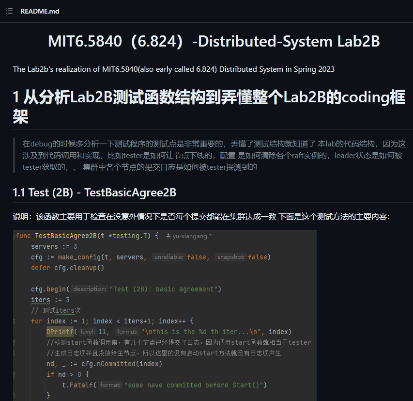

<h1 align="center">MIT6.5840（6.824）-Distributed-System Lab3B</h1>

The Lab3B's realization of MIT6.5840(also early called 6.824) Distributed System in Spring 2023

至于3A和3B的实现，非常推荐大家看一下这篇csdn博客，[MIT6.824-lab3AB-2022（万字推导思路及代码构建）](https://blog.csdn.net/weixin_45938441/article/details/125286772?spm=1001.2014.3001.5506)

# 1 快照的基础知识
## 1.1 什么是快照

## 1.2 快照的主要作用

## 1.3 raft的状态机进行快照时要保存哪些数据

## 1.4 宕机重启的节点如何依据快照恢复

## 1.5 现在我采取的快照策略是每当持久化日志的数据量达到一定大小时就会发送一次快照给raft，现在你能告诉我怎么做才能探测到数据量的变化吗

因为在raft模块实现持久化的时机包括raft节点的任期号，
投票字段以及日志以及每一次发生的变更，所以我们这里在
每一次leader状态机执行日志的时候都会判断一次
快照的大小是否达到了规定的大小，满足就进行一次快照，
这是最简单的方法

## 1.6 当上层的状态机应用快照时，是不是也要消耗一个日志序号

## 1.7 从节点的状态机应用快照时应该清除自己的数据库吗?
从GPT4给的答案来看，是需要清除自己的数据库的

## 1.8 从节点的状态机收到主节点的快照后怎么办？
这里是指下层的raft节点应该怎么办

## 1.9 leader节点的状态机将生成的快照发送给raft节点后还需要做什么

## 1.10 实现Lab2D后，有两次读取持久化数据的过程，分别说明：

第一次是上层的状态机读取快照数据，恢复数据库数据
以及保持Get/Put/Append
操作幂等性的相关元数据，

随后将持久化的指针传递给下层的raft节点后，恢复的是日志，
任期号，投票号等信息。
