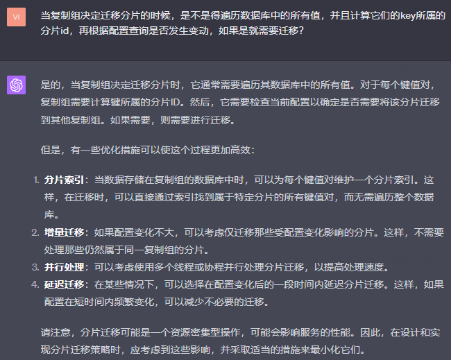
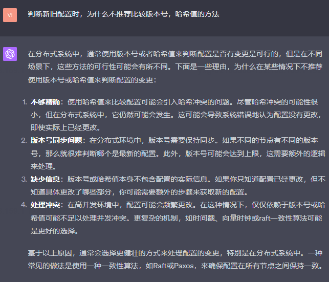

<h1 align="center">MIT6.5840（6.824）-Distributed-System Lab3A</h1>

The Lab3A's realization of MIT6.5840(also early called 6.824) Distributed System in Spring 2023

# 1 基础知识
## 1.1 什么是接口的幂等性

一句话：幂等指接收到多个相同的请求后(可能来自不同的客户端)，
结果和接收一个请求生成的结果一样.

举例子可以参考1.1.2


### 1.1.1 一个合格的api都具有幂等性嘛


### 1.1.2 举几个满足幂等性和非幂等性的例子

1 不幂等性例子：



2 幂等性例子：


### 1.1.3 非幂等性接口转换为幂等性接口的方法和例子

1 方法


2 一些简单的例子
> 加一是不能幂等的，但是也可以实现根据
> id调用n次+1，实际只+1，而不是+n

> 在某些情况下，API可能在特定条件下表现为幂等。
例如，一个通过邮件发送验证码的API可能具有防止频繁发送的逻辑。
在规定的时间内，多次调用可能只发送一次验证码，
使其在这个时间段内表现为幂等。

3 比较复杂的例子

将非幂等性的接口转换为幂等性的接口通常涉及引入某种机制来
检测和防止重复执行。下面是一个常见的示例：

示例：处理银行账户转账
假设你正在开发一个银行应用，并且有一个API接口用于从一个账
户转账到另一个账户。原始接口是非幂等的，因为每次调用都
会转移一定数量的资金。

非幂等接口：
```go
POST /transfer
{
    "fromAccountId": "123",
    "toAccountId": "456",
    "amount": 100
}
```
每次调用这个接口，都会从账户123转移100元到账户456。
如果因为网络问题客户端不知道请求是否成功，可能会多次调
用此接口，导致资金被转移多次。

转换为幂等接口：
为了使这个接口成为幂等的，我们可以引入一个唯一的交易ID。
客户端在发起转账请求时生成这个ID，如果需要重试，
使用相同的ID。
```go
POST /transfer
{
    "transactionId": "abc123",
    "fromAccountId": "123",
    "toAccountId": "456",
    "amount": 100
}
```
在服务器端，我们记录已经处理过的交易ID。
当接收到转账请求时，首先检查交易ID是否已经存在。
如果存在，则不执行转账，并可能返回之前的转账结果。
如果不存在，则执行转账，并记录交易ID。

通过引入交易ID，我们可以确保转账操作，即使在网络不稳定
的情况下被多次调用，也只执行一次。这使得接口在功能上变得幂等。

### 1.1.4 幂等性和数据库中的锁的联系(待定)

### 1.1.5 数据库锁如何保持幂等性(待定)


### 1.1.6 接口的幂等性是相对同一个主机的不同请求还是相对不同主机的不同请求定义的


### 1.1.7 多个主机可能会调用同一个api，修改数据库的同一个资源，这可能导致不同，为什么还能称为幂等


### 1.1.8 为什么需要保证接口的幂等呢？


###  1.1.9在raft算法中，哪里体现了幂等性

不得不说，GPT4在这方面总结的真到位



### 1.1.10 在raft中，针对重复的client请求，会进行去重操作，保证幂等性

具体的原理可以参考：
[raft在处理用户请求超时的时候，如何避免重试的请求被多次应用？](https://www.zhihu.com/question/278551592/answer/400962941)

### 1.1.11 tcp中避免重试的请求被多次应用是不是也保证了幂等性


## 1.2 外部一致性

### 1.2.1 

# 2 实现kvRaft服务器端(状态机)的一些问题

## 2.1 为什么作为状态机的server结构体中需要定义一个互斥锁？


## 2.2 当client发送请求给旧leader，此时client和状态机是如何处理的？

client: rpc调用会发生失败

## 2.3 为什么需要在状态机中判断这个请求是否是重试请求而不是在客户端中判断呢？
> 因为客户端本身是重试的请求产生的源头，是客户端本身认为原先的请求没有被服务器接收，
> 所以会重试

## 2.4 如果一个leader正在处理put请求时宕机了，
此时会造成数据不一致吗？后续raft和状态机会如何处理？

首先我们可以确定，如果这个put的日志没有被大多数raft节点复制，
那么put的请求日志就肯定不会被leader节点提交，也就是说put肯定没有
被状态机执行，此时client会重试

## 2.5 如果是put请求日志刚被leader提交，leader宕机了，会发生什么
> 此时会发生

## 2.6 如果是put请求刚应用到leader节点后，leader宕机了，会发生什么
> 
## 2.7 为什么需要将客户端的id和其对应的请求序列号作为一个日志元素的一部分呢？

首先client如何去重需要参考1.1.10或者下面这个链接：

[raft在处理用户请求超时的时候，如何避免重试的请求被多次应用？](https://www.zhihu.com/question/278551592/answer/400962941)


> 最根本的原因是需要保证每一个raft节点对应的状态机都持有
> 所有客户端发出请求的记录，每一个节点应用日志到
> 状态机的时候会将这个clientId+ProposalId放入到
> 请求map中作为去重机制，就算更换leader节点，
> 新的leader节点中也是携带了请求的，这样新leader也能识别
> 重复的请求。
> 
> 如果作为日志元素的一部分，则只有leader节点有这个请求的
> 日志，当leader宕机后，新leader选出后因为map中没有这个记录
> clientId+ProposalId表示的键而无法识别这是一个重复的请求，
> 所以会将其发送到日志中，从而导致了不幂等

## 2.8 客户端宕机了，重启的客户机clientId会是一样的吗？
> 